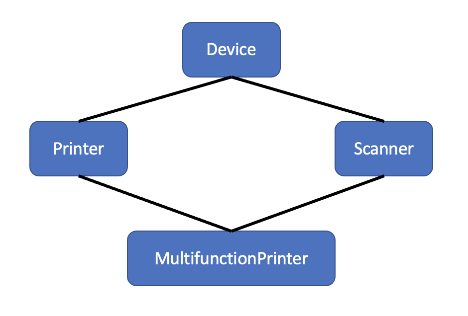

# Overview

The so-called "Diamond Problem" happens when a class inherits from (at least) two other distinct classes that share a common ancestry. To illustrate, consider the example below: 

Assume that the Device class defines a manufacturer, while the Printer class defines a type, and the Scanner class defines a dpi value. The "Diamond Problem" arises when an instance of the MultifunctionPrinter class refers to its manufacturer (instance) variable. Will this instance variable be mapped to the one inherited from Printer or Scanner?

# C++ Implementation

C++ is one of the object-oriented languages that support multiple inheritance. The example.cpp code implements the scenario but because of the "Diamond Problem" it fails to pass compilation. You can use an online compiler to test the code by yourself. For example: [programiz.com](https://www.programiz.com/cpp-programming/online-compiler). 

